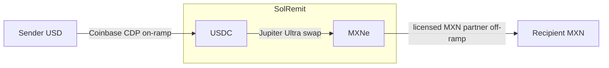

# SolRemit

**Wise-style cross-border remittance on Solana.** Send money **US → Mexico** with
stablecoins, and see *exactly* what arrives — the live Jupiter route, the mid-market rate,
every fee, and the recipient's landed amount, side-by-side vs Wise and Western Union.

> **Status:** working MVP. Integration-first (no custom on-chain program). The FX
> transparency panel runs with **zero credentials**; wallet, on-ramp, and send are gated
> behind CDP setup (see [Activating the gated features](#activating-the-gated-features)).
>
> Built as a learning project, end-to-end with the [solana-new](#how-this-was-built) skill
> suite. Honest about its limits — see [Status & limitations](#status--limitations).

---

## Why it exists

Remittance is expensive (the World Bank pegs the global average near 6%) and slow (T+2+).
On Solana, the same transfer settles in seconds for fractions of a cent. SolRemit's wedge
isn't "crypto remittance" in the abstract — it's **radical FX transparency**: the comparison
panel *is* the product. When SolRemit costs more than an alternative, it says so.

## How it works



1. **On-ramp** — USD → USDC via Coinbase CDP (KYC handled by CDP's licensed rails).
2. **FX** — USDC → MXNe routed through **Jupiter** for best price; route, price impact, and
   fees are read back and shown to the user.
3. **Off-ramp** — MXNe → recipient's MXN bank via a licensed partner (integration is a stub
   pending partner selection).
4. **Transparency** — a deterministic breakdown (`lib/fx`) turns the quote + ramp fees into
   the numbers the comparison panel shows.

## The differentiator

The `/api/fx/quote` endpoint returns a full cost breakdown that powers the panel:

- Mid-market rate (Jupiter Price v3) vs your effective rate, and the spread
- Per-line fees: on-ramp, FX (Jupiter), Solana network, off-ramp, **SolRemit fee**
- Total landed MXN + savings vs Wise / Western Union
- A **trust check** on the destination stablecoin (MXNe isn't on Jupiter's verified list and
  has dozens of pump.fun impostors — the app resolves + verifies the mint before routing)

---

## Tech stack

| Layer | Choice |
|---|---|
| Framework | Next.js 16 (App Router) + TypeScript |
| Styling | Tailwind 4, custom OKLCH token system (brand: *Forest Stake*) |
| Solana | `@solana/client` + `@solana/react-hooks` (framework-kit) |
| FX | Jupiter REST — Tokens v2, Price v3, Ultra `/order` + `/execute` |
| Wallet + on-ramp | Coinbase CDP embedded wallets + Onramp (`@coinbase/cdp-hooks`, `@coinbase/cdp-sdk`) |
| RPC | Helius (any RPC works) |
| Tests | Vitest |

## Project structure

```
app/
  page.tsx                     # landing: panel + wallet + send flow
  components/
    fx-comparison-panel.tsx    # the transparency / savings panel
    wallet-bar.tsx             # CDP email-OTP sign-in + "Add funds"
    send-flow.tsx              # review -> sign -> execute
    cdp-provider.tsx           # mounts CDP only when configured
    num.tsx                    # mono/tabular number primitive
  api/
    fx/{quote,order,execute}/  # quote (read-only), build signable tx, submit signed tx
    onramp/{buy-options,buy-quote}/  # CDP Onramp proxies (server JWT)
lib/
  solana/constants.ts          # USDC + MXNe mints, launch corridor
  jupiter/                     # client, tokens (trust check), price, quote, execute
  fx/                          # deterministic breakdown + markup math (+ tests)
  format/number.ts             # number-formatting spec (no scientific notation, etc.)
  cdp/                         # config, server JWT auth, onramp camelCase, README + setup
  rate-limit.ts                # in-memory API throttle
brand.md                       # palette, typography, voice
```

---

## Getting started

Requires Node 22+.

```bash
git clone https://github.com/0xSardius/SolRemit.git
cd SolRemit
npm install
cp .env.example .env.local      # FX panel works even with this left as-is
npm run dev                     # http://localhost:3000
```

The **FX transparency panel works immediately** — it uses Jupiter's free `lite-api` with no
key. Wallet/on-ramp/send stay off until you add CDP credentials below.

## Environment variables

All secrets are server-side (no `NEXT_PUBLIC_` prefix); `.env*` is gitignored. See `.env.example`.

| Variable | Required for | Notes |
|---|---|---|
| `NEXT_PUBLIC_SOLANA_RPC_URL` | Prod RPC | Helius recommended; falls back to public devnet |
| `HELIUS_API_KEY` | Server RPC | optional |
| `NEXT_PUBLIC_CDP_PROJECT_ID` | Wallet + on-ramp | **gates** all embedded-wallet UI |
| `CDP_API_KEY_ID` / `CDP_API_KEY_SECRET` | On-ramp server JWT | server-only secrets |
| `JUPITER_API_KEY` | Metered Jupiter | optional — without it the free `lite-api` is used |
| `JUPITER_API_BASE` | Jupiter host override | optional |
| `OFFRAMP_PARTNER_API_KEY` / `OFFRAMP_PARTNER_BASE_URL` | Off-ramp | fill when partner selected |
| `SOLREMIT_FEE_BPS` | Revenue | disclosed FX markup, default `35` (0.35%) |
| `SOLREMIT_FEE_ACCOUNT` | Revenue collection | referral token account; collects markup on-chain |

## Activating the gated features

Wallet + on-ramp + send are intentionally gated so the app runs with zero setup. To turn them on:

1. **Create a CDP project** at [portal.cdp.coinbase.com](https://portal.cdp.coinbase.com) → copy the **Project ID**.
2. **Create a Secret API Key** (API Key ID + Secret).
3. **Allowlist your domain** (`http://localhost:3000` for dev) under Embedded Wallets → Security.
4. Fill `NEXT_PUBLIC_CDP_PROJECT_ID`, `CDP_API_KEY_ID`, `CDP_API_KEY_SECRET` in `.env.local`.
5. Onramp runs in **trial mode** by default; enable mock buys to test without real money. A
   **devnet USDC faucet** is available via CDP for transfer testing.

> Full notes in [`lib/cdp/README.md`](lib/cdp/README.md). The send flow additionally needs a
> wallet holding USDC to produce a signable transaction.

## API routes

| Route | Method | Purpose |
|---|---|---|
| `/api/fx/quote?usd=` | GET | Read-only breakdown + savings (no wallet needed) |
| `/api/fx/order?usd=&taker=` | GET | Builds a signable USDC→MXNe transaction |
| `/api/fx/execute` | POST | Submits a signed transaction to Jupiter |
| `/api/onramp/buy-options` | GET | CDP onramp payment options (server JWT) |
| `/api/onramp/buy-quote` | POST | CDP onramp quote + one-click URL |

All routes are IP rate-limited (`lib/rate-limit.ts`).

## Revenue model

Monetization is a **transparent FX markup** — a disclosed "SolRemit fee" line (default 35 bps,
`SOLREMIT_FEE_BPS`). When `SOLREMIT_FEE_ACCOUNT` is set, the markup is collected **on-chain**
via Jupiter's `referralFee` at swap time (Jupiter takes ~20% of integrator fees). On a $200
send that's $0.70, shown in the breakdown — on-brand because the user sees it.

> Honest caveat baked into the build: at the current *illustrative* ramp fees, SolRemit beats
> Western Union but loses to Wise. The lever is **cheaper ramps**, not FX (Jupiter is already
> near mid-market). See `.superstack/build-context.md`.

## Testing & build

```bash
npm test        # vitest — FX breakdown + revenue accounting
npm run build   # type-check + production build
npm run lint
```

## Security

A `cso` daily-mode audit lives in `.superstack/security-reports/`. Highlights: secrets are
server-side and never committed; no SSRF (hardcoded upstream hosts); fail-closed credential
and price checks; the destination-token trust check; private keys never touch the server
(signing is client-side via the CDP embedded wallet). Remediated: a transitive `ws` advisory
(`overrides` pin) and added API rate limiting.

---

## Status & limitations

- ✅ **FX core** — quote/order/execute, live-verified against Jupiter
- ✅ **Transparency UI** — verified rendering with real data
- ✅ **Security pass, brand, revenue** — done
- ◑ **Wallet + on-ramp** — built and gated; needs CDP credentials + domain allowlist to run
- ◑ **Send flow** — order→sign→execute wired; needs a funded wallet for a full executed swap
- ⬜ **Off-ramp** — partner integration is a stub
- ⬜ **Not built (the actual business):** real licensing/compliance at scale, distribution,
  a production off-ramp partner, mainnet deploy

This is a **learning MVP**, not a launched product. It proves the thesis is technically sound
and cheap to test; it does not prove anyone will switch. In a crowded field (Wise, Western
Union on Solana, MoneyGram, Sphere, Decaf, KAST), the moat is distribution and trust, not code.

## How this was built

Every phase was driven by a [solana-new](https://github.com/) skill, in order:
`validate-idea` → `scaffold-project` → `integrating-jupiter` → `number-formatting` +
`frontend-design-guidelines` → `solana-dev` + Coinbase CDP MCP → `cso` → `brand-design`.

## Disclaimer

Educational project. Not financial advice. Not a licensed money transmitter — any real
deployment must run on licensed partner rails and meet KYC/AML/Travel-Rule obligations.
Mainnet involves real funds and irreversible transactions.
